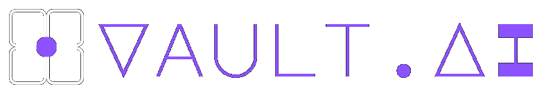
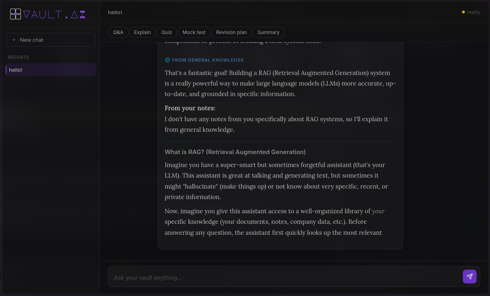
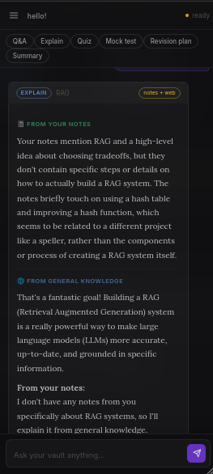

# Vault.AI



Vault.AI turns existing Markdown notes, Obsidian vaults, and personal knowledge bases into an AI assistant that makes learning easier. Instead of uploading documents into another platform, students can keep using the tools they already love while getting explanations, quizzes, revision plans, and mock tests grounded in their own notes.

---

## Features

* Q&A from your notes
* Concept explanations
* Quiz generation
* Mock test creation
* Revision plans
* Knowledge gap detection
* Web fallback when information is missing
* Responsive mobile interface
* Terminal interface
* Flexible frontend design

---

## Philosophy

Most AI study tools come with limitations and restrictions. Vault.AI prioritizes flexibility and efficiency.

Vault.AI treats AI as an engine rather than a website.

The same backend can power:

* Desktop web applications
* Mobile experiences
* Terminal interfaces
* Future Discord bots
* Obsidian integrations
* Any UI you want to build

Your notes stay yours.

Your workflow stays yours.

The AI simply makes your knowledge searchable, interactive, and useful.

---

## Screenshots

### Desktop UI



### Mobile UI



## How It Works

```text
Student Notes (.md files)
            ↓
Text Chunking
            ↓
Gemini Embeddings (3072 dimensions)
            ↓
Supabase + pgvector
            ↓
Intent Router
            ↓
Q&A | Explain | Quiz | Mock Test | Revision Plan
            ↓
Web Search (optional fallback)
            ↓
Final Response
```

---

## Available Workflows

### Q&A

Basic questions answered quickly and directly from your notes.

### Explain

Receive detailed explanations using your own material, with optional web support when needed.

### Quiz

Generate practice questions for active recall and revision.

### Mock Test

Create larger tests covering multiple topics with increased difficulty.

### Revision Plan

Identify weak areas and build personalized study schedules.

### Summary

Condense lengthy topics into a paragraph or two.

---

## Interfaces

### Desktop UI

The primary experience inspired by modern knowledge-management tools.

### Mobile UI

Responsive design for studying on phones and tablets.

### CLI Interface

```bash
python cli.py
```

```text
=== Vault.AI CLI Assistant ===
Your knowledge base is ready.
Type 'help' for commands or 'exit' to quit.
```

### Any UI You Want

Build your own frontend and simply connect it to the worker URL. The backend handles retrieval, reasoning, and workflows while the frontend focuses on aesthetics and user experience.

---

## Technology Stack

### Backend

* Cloudflare Workers
* Python
* Supabase
* Gemini API

### AI

* Gemini 2.5 Flash Lite
* Gemini Embeddings (3072d)

### Frontend

* HTML
* CSS
* JavaScript
* Anything else if you want

### Knowledge Sources

* Obsidian Markdown vaults
* Standard `.md` files

---

### Setup

### Requirements

Before getting started, make sure you have:

* A Gemini API key
* A Supabase project (URL and API key)
* A Cloudflare account authenticated on your machine
* Python 3.10 or newer
* `pip`
* `git`

Clone the repository:

```bash
git clone https://github.com/YOUR_USERNAME/Vault.AI.git
cd Vault.AI
```

Run the setup scripts:

```bash
./setup.sh
./configure.sh
./deploy.sh
```

* `setup.sh` installs all required dependencies.
* `configure.sh` creates and configures the necessary environment files.
* `deploy.sh` deploys the Cloudflare Worker and prepares the application.

You can then use either the web interface (ui/index.html) or the terminal client:

```bash
python cli.py
```


## Why Vault.AI?

* No proprietary note formats.
* No vendor lock-in.
* Works with existing Markdown files.
* Multiple interfaces powered by the same backend.
* Personalized responses grounded in student-created material.
* No machine learning expertise required.

---

## Future Plans

* Discord bot integration
* Obsidian plugin
* Theme system
* Collaborative study groups
* Additional workflow types
* Self-hosted deployment options
* Support for PDFs, DOCX files, spreadsheets, and other formats

---

## License

GNU GPL v3.0

